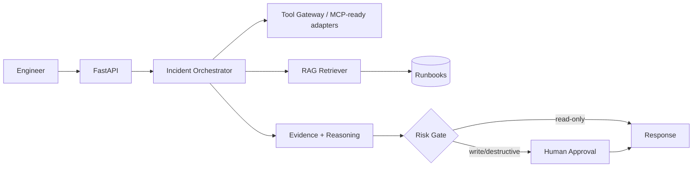

# SentinelOps AI 🛡️

> An agentic DevOps incident commander that investigates incidents using evidence, retrieves operational runbooks, proposes remediations, and keeps humans in control of risky actions.

## Why this project exists
Traditional alerting tells an engineer **what** failed. SentinelOps is designed to help investigate **why** it failed. It combines an incident workflow, retrieval-augmented generation (RAG), tool-style infrastructure adapters, safety gates, evaluation, and production-oriented DevOps practices.

**Portfolio goal:** demonstrate AI engineering + DevOps/SRE skills in one verifiable system rather than another chatbot demo.

## Demo scenario
Ask: `Why did checkout-api start failing after the latest deployment?`

SentinelOps retrieves relevant runbooks, collects deployment/service evidence, correlates it, returns an evidence-backed assessment, proposes remediation, and requires human approval before risky changes.

> The repository ships with safe simulated infrastructure data. No production credentials are required for the demo.

## Architecture


## Recruiter quick scan
| Signal | Demonstrated here |
|---|---|
| AI engineering | RAG, grounded evidence, orchestration, evaluation |
| Agentic systems | workflow, tools, approval gates |
| DevOps/SRE | incident triage, runbooks, Kubernetes concepts |
| Backend | Python, FastAPI, typed schemas |
| Security | tool permissions, risk classification, no secret logging |
| Platform engineering | Docker, Kubernetes, Terraform |
| CI/CD | GitHub Actions lint + tests |
| Quality | pytest + deterministic incident evals |

## Quick start
Requires Python 3.11+.
```bash
python -m venv .venv
source .venv/bin/activate
pip install -e ".[dev]"
uvicorn sentinelops.api:app --reload
```

```bash
curl -X POST http://127.0.0.1:8000/v1/incidents/analyze -H "Content-Type: application/json" -d '{"service":"checkout-api","question":"Why is checkout-api failing after the latest deployment?"}'
```

No paid LLM key is required for the deterministic MVP. Recruiters can clone and verify the core workflow immediately.

## Test and evaluate
```bash
pytest -q
python evals/evaluate.py
```

Evaluation results are generated by code; this project does not claim fabricated accuracy numbers.

## Safety model
**AI may investigate automatically; AI may not silently change infrastructure.** Read-only inspection is permitted. Rollback, restart, scale, delete, or apply operations require explicit approval.

## What makes this different
Many portfolio agents stop at “LLM + prompt + vector DB.” SentinelOps focuses on engineering around the model: evidence provenance, deterministic fallbacks, explicit permissions, human approval, testable evaluation, CI, containerization, IaC, and incident memory.

## Roadmap
- [x] Recruiter-ready architecture
- [x] Deterministic RAG-style runbook retrieval
- [x] Simulated deployment/metrics tool adapters
- [x] Risk-based action gate
- [x] API and tests
- [x] CI and container build
- [x] LangGraph orchestration
- [x] MCP read-only tool server
- [ ] pgvector/Qdrant persistence
- [x] Prometheus instrumentation
- [x] AWS reference deployment architecture
- [ ] Real Kubernetes read-only adapter
- [ ] LLM provider adapter + grounded-answer evaluation

## Interview walkthrough
See `docs/INTERVIEW_GUIDE.md` and `docs/PROJECT_WALKTHROUGH.md`.

## Verified build
GitHub Actions verifies Ruff linting, pytest, deterministic evaluation, and dependency auditing. The validated v0.2.0 build passed 7 tests and the demo evaluation scored 2/2 (100%). These numbers describe the repository test/evaluation suite, not production AI accuracy.

## Responsible portfolio note
This is a portfolio/reference implementation. The demo uses simulated operational data and does not claim production deployment or business impact that did not occur.

## License
MIT
