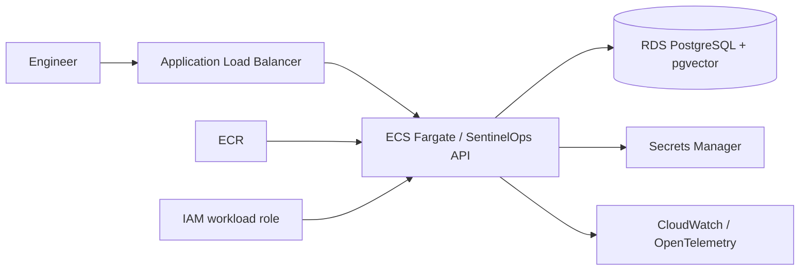

# AWS reference deployment

The local demo remains free and reproducible. For a production-style AWS deployment, the recommended path is:

## Design choices
ECS/Fargate is a simpler first managed deployment than operating EKS solely for one API. Kubernetes manifests remain in the repository to demonstrate portability and platform skills. RDS PostgreSQL can hold both durable incident state and pgvector embeddings, reducing the number of stateful systems for an MVP.

## Cost safety
Terraform in this repository is a reference scaffold and does **not** provision chargeable AWS resources by default. Before enabling cloud resources, add a budget/alarm, remote state, private networking, TLS, workload IAM, secret rotation, backups and environment-specific variables.
